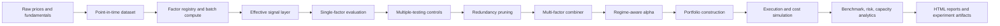

<div align="center">

# EntroPy

**Production-oriented multi-factor equity research platform**

EntroPy tests whether state-space, regime, entropy, mean-reversion, and classic cross-sectional factors can produce robust, cost-aware, capacity-aware equity alpha under point-in-time data discipline and rolling out-of-sample validation.

[中文说明](README.zh-CN.md) | [Upgrade Notes](docs/PRODUCTION_FACTOR_RESEARCH_UPGRADE_2026_05.md) | [Factor Dictionary](docs/factor_dictionary_beginner.md)

[](https://www.python.org/downloads/)
[](LICENSE)
[](#testing)
[](#signal-library)

</div>

---

## Research Goal

EntroPy is built around one practical quant research question:

> Can advanced signal-processing features add incremental, tradable alpha after realistic costs, factor redundancy, multiple testing, benchmark risk, and capacity constraints?

The platform moves beyond "best-looking backtests" toward a production research workflow with rigorous gatekeeping at every stage:

- Correct signal direction and standardized effective signals.
- **Newey-West HAC IC t-stat** to correct for autocorrelation from overlapping forward returns.
- **Alpha decay half-life estimation** to drive rebalance frequency decisions.
- **Long/short leg attribution** to assess long-only deployability.
- **Cross-sectional stability** across size/liquidity buckets.
- Multi-horizon single-factor validation with multiple-testing controls (FDR, Hansen SPA, CSCV).
- **Hierarchical clustering** redundancy pruning (keeps 3-5 complementary factors).
- Comparable multi-factor combiners with regime-aware weighting.
- Factor-risk-model-based portfolio optimization.
- **Production Readiness Score (PRS)** — 7-dimensional 0-100 score with ACCEPT/CONDITIONAL/REJECT verdict.
- **Factor Discovery Tearsheet** — self-contained HTML per factor with all key charts.
- **Multi-Factor Decision Story** — end-to-end narrative HTML report.
- YAML-driven experiment orchestration for reproducible research.

## Core Capabilities

| Area | Capabilities |
| --- | --- |
| Data layer | US/CN market calendar support, dynamic universe filters, point-in-time price and fundamental alignment, benchmark loading |
| Signal library | 42 registered cross-sectional, time-series, regime, and relative-value factors |
| Effective signal | `direction -> winsorize -> neutralize -> z-score -> rank` shared by evaluation, portfolio, ML, and reporting |
| Single-factor research | 1/5/10/20d IC and RankIC, **NW HAC t-stat**, IC decay + **half-life**, quintile monotonicity, turnover, break-even cost, **long/short leg attribution**, **cross-section stability**, capacity, OOS stability |
| Multiple testing | Benjamini-Hochberg FDR, Bonferroni, **Hansen SPA test** (superior to White RC), Deflated Sharpe, **full combinatorial CSCV** |
| Redundancy pruning | Factor signal correlation, return correlation, exposure similarity, **hierarchical cluster selection**, stepwise incremental alpha check |
| Multi-factor alpha | Rolling ICIR weighting, factor-return mean-variance, factor-return risk parity, baseline-orthogonal incremental alpha |
| Regime integration | Regime-driven factor weights, category enable/disable, net exposure, rebalance threshold, alpha scaling |
| Portfolio construction | Quantile portfolios, optimized portfolios, equal/market-cap/signal/inverse-vol weighting, sector/stock/turnover constraints |
| Risk model | Barra-style factor risk model with exposures, factor covariance, specific risk, and decomposition |
| Execution and costs | Dynamic-NAV trade sizing, slippage, impact, commissions, borrow cost, cost attribution |
| Backtest analytics | Net/gross NAV, drawdown, VaR/CVaR, benchmark alpha/beta/IR, capacity and capital scaling curves |
| **Production Readiness** | **7-dim PRS (0-100), Factor Discovery Tearsheet (HTML), Decision Story Report (HTML)** |
| Experiments | YAML configs for factor sets, combiners, costs, walk-forward, benchmark, and capacity settings |

## Signal Library (42 Registered Factors)

| Signal Type | Examples | Primary Use |
| --- | --- | --- |
| Momentum | `MOM_12_1M`, `STR_1M`, `MOM_PATH`, **`RESID_MOM_12_1M`**, **`OVERNIGHT_RET_21D`** | Trend, reversal, and microstructure signals |
| Volatility | `VOL_20D`, `IDIOVOL`, `TAIL_RISK`, `REALIZED_JUMP`, `VOL_OF_VOL` | Risk and tail-risk cross-section |
| Liquidity | `ILLIQ_AMIHUD`, `SPREAD_HL`, `PRICE_IMPACT`, `ABNORMAL_VOLUME` | Liquidity premium and market impact |
| Value / Quality | `BOOK_TO_MARKET`, `EARNINGS_YIELD`, `GROSS_PROFITABILITY`, `ASSET_GROWTH`, **`ACCRUALS`**, **`PIOTROSKI_F8`** | Fundamental screening |
| Time-series | `KF_VELOCITY`, `KF_TREND_STRENGTH`, `SPECTRAL_ENTROPY_60D`, `HURST_60D`, rolling skew/kurtosis | Per-asset latent state and trend/noise features |
| Regime | `HMM_TURBULENCE_PROB` | Market-state-aware factor allocation and exposure control |
| Relative value | `OU_ZSCORE` | Mean-reversion quality and spread-style diagnostics |

Factor metadata includes `direction`, `category`, `signal_type`, lookback, lag, and description. Negative-direction factors, such as low volatility or low asset growth, are flipped into a "higher is better" effective signal before evaluation or portfolio use.

## Research Pipeline


```mermaid
flowchart LR
    A["Raw prices and fundamentals"] --> B["Point-in-time dataset"]
    B --> C["Factor registry and batch compute"]
    C --> D["Effective signal layer"]
    D --> E["Single-factor evaluation"]
    E --> F["Multiple-testing controls"]
    F --> G["Redundancy pruning"]
    G --> H["Multi-factor combiner"]
    H --> I["Regime-aware alpha"]
    I --> J["Portfolio construction"]
    J --> K["Execution and cost simulation"]
    K --> L["Benchmark, risk, capacity analytics"]
    L --> M["HTML reports and experiment artifacts"]
```

## Multi-Factor Combination

EntroPy supports several comparable production-style combiners:

| Combiner | Method | When to Use |
| --- | --- | --- |
| `rolling_icir` | Weight factors by rolling RankIC mean divided by volatility | Baseline adaptive factor allocation |
| `mean_variance` | Use factor long-short return mean and covariance | Return/risk optimized factor allocation |
| `risk_parity` | Inverse volatility of factor return streams | Robust allocation when expected returns are noisy |
| `orthogonal_incremental` | Residualize candidate factors against baseline factors before weighting | Testing whether advanced signals add true incremental alpha |

## Experiment Runner

Experiments in `quant_platform/experiments/*.yaml` are executable. They define data ranges, factor sets, redundancy thresholds, combiners, portfolio constraints, costs, benchmark settings, and capacity grids.

```bash
# List experiments
python scripts/run_experiment.py --list

# Run a baseline multi-factor experiment
python scripts/run_experiment.py --config quant_platform/experiments/us_baseline.yaml

# Run the advanced signal lab experiment
python scripts/run_experiment.py --config quant_platform/experiments/us_signal_lab.yaml
```

Typical outputs are written to `data/experiments/<experiment_name>/`:

- `selected_factors.csv`
- `redundancy_*.csv`
- `weights_<experiment>.parquet`
- `factor_weights.csv`
- `regime_controls.csv`
- `backtest/performance_summary.csv`
- `backtest/capacity_summary.csv`
- `backtest/capacity_curve.csv`
- `experiment_summary.json`

## Quick Start

```bash
pip install -r requirements.txt

# 1. Build the point-in-time dataset
python scripts/build_dataset.py

# 2. Compute and evaluate all factors
python scripts/build_factors.py --evaluate

# 3. Build a single-factor portfolio
python scripts/build_portfolio.py --signal MOM_12_1M

# 4. Run execution-aware backtest
python scripts/run_backtest.py

# 5. Generate research report
python scripts/generate_report.py --signal MOM_12_1M
```

Multi-factor portfolio example:

```bash
python scripts/build_portfolio.py \
  --factors MOM_12_1M \
  --factors STR_1M \
  --factors VOL_20D \
  --factors ILLIQ_AMIHUD \
  --combiner rolling_icir \
  --method optimize \
  --turnover-penalty 0.1
```

One-command factor pipeline:

```bash
python scripts/run_factor_pipeline.py --factors MOM_12_1M
python scripts/run_factor_pipeline.py --auto-best
python scripts/run_factor_pipeline.py --all-factors --quick
```

Factor tuning:

```bash
python scripts/tune_factors.py --objective ric_icir --top 5
```

## Portfolio and Backtest

### Portfolio Construction

- Quantile long-only and long-short portfolios.
- Optimized portfolios with factor-risk covariance fallback to shrunk stock covariance.
- Equal, market-cap, signal-proportional, and inverse-volatility weighting.
- Stock-level, sector-level, and turnover constraints.
- Regime-aware cash holding through net exposure scaling.

### Execution and Costs

- Trades are generated from daily weight changes.
- Trade size follows evolving portfolio NAV.
- Costs include commission, slippage, square-root market impact, regulatory fees, stamp duty placeholder, and borrow cost.
- Borrow cost is based on dynamic NAV and short exposure.

### Benchmark and Capacity

Backtests can include benchmark-relative analytics:

- Active return and tracking error.
- Information ratio.
- CAPM alpha, beta, alpha t-stat, and residual volatility.

Capacity analytics include:

- Participation rate.
- ADV notional percentage.
- 10% ADV capacity estimate.
- Cost elasticity under different capital levels.
- Estimated net Sharpe by capital size.

## Architecture

```text
quant_platform/
├── core/
│   ├── data/                  # PIT data, calendars, universe, benchmark, sector map
│   ├── signals/               # Factor base, registry, effective signal, selection, redundancy
│   │   ├── cross_sectional/    # 32 CS factors: momentum, volatility, liquidity, value/quality
│   │   │   evaluation.py       # ★ NW HAC IC, alpha half-life, long/short attribution, stability
│   │   ├── time_series/        # Kalman, entropy, Hurst, higher moments
│   │   ├── regime/             # HMM turbulence probability
│   │   ├── relative_value/     # OU mean-reversion features
│   │   └── evaluation/         # Type-specific evaluation scorecards
│   │   factor_selection.py     # ★ Hansen SPA test, FDR, deployability filters
│   │   redundancy.py           # ★ Hierarchical cluster-based factor selection
│   ├── alpha_models/           # Ranker, ML alpha, regime overlay, multi-factor combiner
│   ├── portfolio/              # Quantile, optimizer, constraints, risk model, pipeline
│   ├── execution/              # Cost models, vectorized backtest, PnL
│   ├── evaluation/             # Walk-forward, ablation, benchmark, capacity
│   │   overfit.py              # ★ Full combinatorial CSCV (Bailey et al. 2017)
│   │   production_readiness.py # ★ 7-dim Production Readiness Score (PRS)
│   │   tearsheet.py            # ★ Factor Discovery Tearsheet (HTML)
│   │   report_story.py         # ★ Multi-Factor Decision Story Report (HTML)
│   └── experiments/            # YAML experiment runner
├── experiments/                # Experiment YAML configs
├── notebooks/                  # ★ factor_research_walkthrough.ipynb (end-to-end demo)
├── scripts/                    # CLI entry points
├── tests/                      # 202 unit and regression tests
└── docs/                       # Design docs + Factor Dictionary for Beginners
```

## Key Commands

| Command | Purpose |
| --- | --- |
| `python scripts/build_dataset.py` | Build price/universe/fundamental data |
| `python scripts/build_factors.py --evaluate` | Compute factors and save factor catalog |
| `python scripts/build_portfolio.py` | Build portfolio weights |
| `python scripts/run_backtest.py` | Run execution-aware backtest |
| `python scripts/generate_report.py` | Generate HTML research report |
| `python scripts/run_factor_pipeline.py` | Run factor-to-report pipeline |
| `python scripts/run_experiment.py` | Run YAML-defined experiment |
| `python scripts/tune_factors.py` | Run factor parameter tuning |

## Jupyter Notebook Walkthrough

An end-to-end interactive demo is available in `notebooks/factor_research_walkthrough.ipynb`:

1. Build synthetic price panel (or swap in real data)
2. Compute 8 representative factors via the registry
3. Single-factor tearsheets with NW HAC t-stat, half-life, leg attribution
4. Multiple-testing controls (FDR, Hansen SPA, full CSCV)
5. Hierarchical clustering redundancy pruning
6. Multi-factor combiner comparison (4 methods, OOS Sharpe)
7. Production Readiness Score for every factor
8. Generate HTML tearsheets and Decision Story report

```bash
cd notebooks
jupyter notebook factor_research_walkthrough.ipynb
```

## Testing

```bash
python -m compileall quant_platform scripts
pytest -q
```

Latest verified result:

```text
202 passed   # 172 original + 30 new tests for upgrades
```

## Known Limitations

- The default US universe approximates large-cap index membership using dynamic market-cap and liquidity filters; it is not official historical S&P 500 membership.
- Daily OHLCV data cannot capture intraday execution and microstructure effects.
- The factor risk model is intentionally compact compared with commercial Barra models.
- White Reality Check and Deflated Sharpe are lightweight approximations intended for research hygiene, not a full academic replication package.
- Fundamental data quality depends on SimFin coverage and reporting lag assumptions.
- CN A-share support includes configuration and cost-model hooks, but local data availability and market-specific execution rules should be validated before production use.

## Documentation

- [Production Factor Research Upgrade](docs/PRODUCTION_FACTOR_RESEARCH_UPGRADE_2026_05.md)
- [Factor Dictionary for Beginners](docs/factor_dictionary_beginner.md) ← **New** — explains every factor intuitively
- [Data Dictionary](docs/data_dictionary.md)
- [Factor Dictionary](docs/factor_dictionary.md)
- [Portfolio Dictionary](docs/portfolio_dictionary.md)
- [Trading Dictionary](docs/trading_dictionary.md)

## Tech Stack

`pandas` · `numpy` · `scipy` · `numba` · `scikit-learn` · `pyarrow` · `matplotlib` · `plotly` · `yfinance` · `simfin` · `exchange_calendars` · `loguru`

## License

[MIT](LICENSE)
